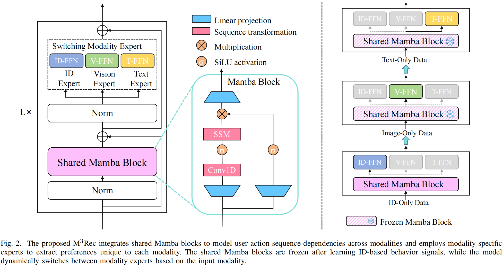

# M<sup>3</sup>Rec: Selective State Space Models with Mixture-of-Modality Experts for Multi-Modal Sequential Recommendation


This is our Pytorch implementation for ICASSP 2025 paper [M<sup>3</sup>Rec: Selective State Space Models with Mixture-of-Modality Experts for Multi-Modal Sequential Recommendation]().
<p align="center">

</p>

> 🚀🚀M<sup>3</sup>Rec is a new multimodal sequential recommendation framework that integrates a <u>M</u>amba-based selective state space model with <u>M</u>ixture-of-<u>M</u>odality Experts.M<sup>3</sup>Rec strengthens the modeling of user action sequence dependencies through shared Mamba blocks across modalities and employs modality experts to extract modality-specific user preferences. 

<h2>Dependencies </h2>

All experiments are conducted on an NVIDIA 24GB 3090 GPU. The required packages are as follows:
* Python 3.7+
* PyTorch 1.12+
* CUDA 11.6+
* Install RecBole:
  * `pip install recbole`
* Install causal Conv1d and the core Mamba package:
  * `pip install causal-conv1d>=1.2.0`
  * `pip install mamba-ssm`

<h2>Datasets</h2>

> 📢📢We provide public three pre-processed datasets requiring no additional processing on [Google Drive](https://drive.google.com/drive/folders/1OzJ_5zLaP-5feF6otRDlDsMLWxci3syL?usp=drive_link). You can download and place them in the "./dataset". 

>✨✨To facilitate research in multimodal sequential recommendation systems, we provide code for preprocessing the [original Amazon datasets](http://jmcauley.ucsd.edu/data/amazon/links.html) in "preprocess/data_preprocess.ipynb". If you find this resource useful for your work, please kindly cite our work. 

<h2>Run</h2>

```python run_M3Rec.py```

<h2>Note</h2>

> 🔥🔥In our experiments, we observed significant performance differences across different python environments. Through detailed analysis, we analyze these discrepancies from version differences between the Mamba's required dependency "causal-conv1d" and "mamba-ssm". To ensure transparency and reproducibility, we have released the training logs under the "./best_log" and corresponding model weights in [Google Drive](https://drive.google.com/drive/folders/1YHZKPOb10yw2zHVPkSFCQcSUQseIngF6?usp=drive_link).


## Citation


## Acknowledgment

This project is based on [Mamba4Rec](https://github.com/chengkai-liu/Mamba4Rec), [Mamba](https://github.com/state-spaces/mamba), [Causal-Conv1d](https://github.com/Dao-AILab/causal-conv1d), and [RecBole](https://github.com/RUCAIBox/RecBole). Thanks for their excellent works.
